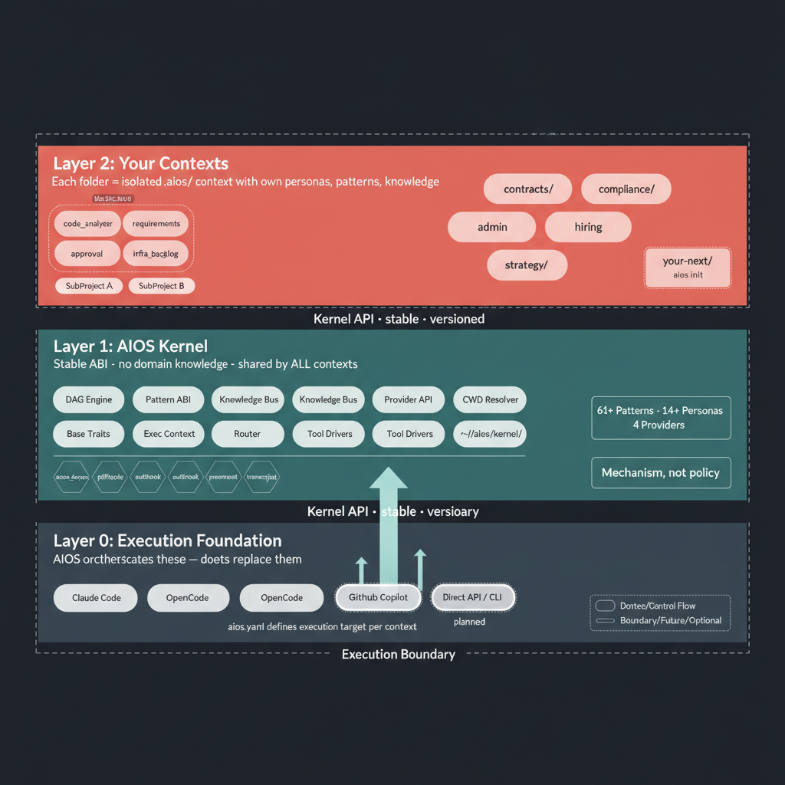
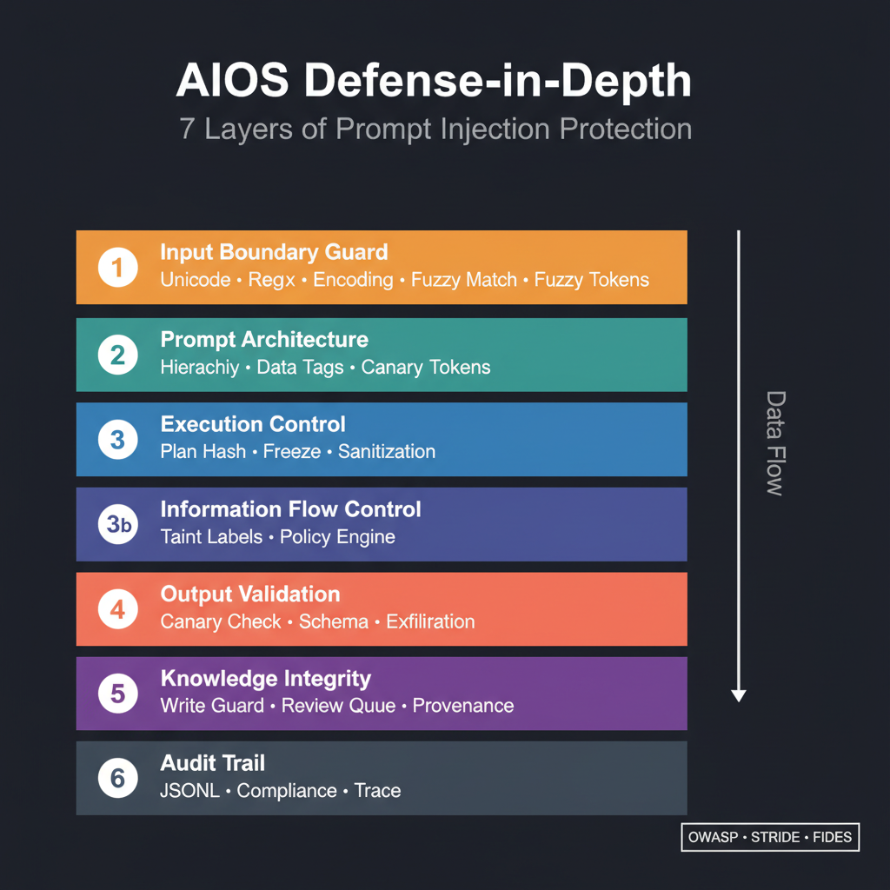

# AIOS — AI Orchestration System

> Stop rebuilding AI agents in every project. AIOS gives each directory its own AI context — backed by a shared kernel.

---

## Why AIOS Exists

You work with AI in a project. You define roles, write prompts, build RAG pipelines, tune the setup until it works well.

Then the next project starts. You start from scratch. Copy-paste prompts, manually keep personas in sync. Five directories, five times the same work. Every new insight means updating all of them. What works in one project, the others don't know about.

The realization: the problem isn't AI — the problem is that there's no operating system for AI agents. What Unix is for processes is missing for AI contexts: isolation, shared resources, stable interfaces.

AIOS separates the **kernel** (orchestration, providers, patterns) from the **user space** (project-local `.aios/` contexts). Run `aios init` — and the project has its own AI context, backed by 62+ patterns and 14+ personas from the kernel.

---

## How It Works

Three layers, clear separation:

- **Layer 0 — Execution Foundation:** The AI tools you already use (Claude Code, Ollama, APIs). AIOS doesn't replace them — AIOS orchestrates them.
- **Layer 1 — AIOS Kernel:** The operating system. Patterns, routing, DAG execution, knowledge bus. Shared by all projects. Stable ABI — upgrades don't break your contexts.
- **Layer 2 — Your Contexts:** Each project directory gets `.aios/` with its own personas, patterns, and knowledge. Isolated from each other. Auto-discovered via CWD.



---

## What You Get

- **62+ patterns** — analysis, review, generation, reporting, RAG, vision, procurement, storytelling, and more
- **14+ specialized personas** — Architect, Developer, Security Expert, Tech Writer, Requirements Engineer, Product Owner, and more
- **4 LLM providers** — Anthropic, Ollama, Gemini, OpenAI — with automatic cost-based selection
- **MCP server integration** — PDF, Azure DevOps, Outlook, and more auto-registered as patterns
- **RAG with local embeddings** — semantic search over your project's knowledge
- **Prompt injection defense** — OWASP LLM01 defense-in-depth with taint tracking
- **Context isolation per project** — each `.aios/` is a boundary, zero leakage between projects

## What You Don't Get (and Why)

- **No finished app** — AIOS is a kernel, not a product. You compose what you need.
- **No domain logic** — your industry-specific patterns belong in your context (`.aios/patterns/`), not in the kernel.
- **No GUI** — CLI-first, Unix philosophy. Pipe it, script it, compose it.
- **No vendor lock-in** — providers are swappable. Today Claude, tomorrow Ollama, next week Gemini. Your patterns don't change.

---

## Getting Started

**1. Install**

```bash
curl -fsSL https://raw.githubusercontent.com/trosinde/AIOS/main/install.sh | bash
```

**2. Configure your provider**

```bash
aios configure
```

**3. Init your project**

```bash
cd my-project
aios init --quick
```

**4. Extract requirements from a specification**

```bash
cat spec.md | aios run extract_requirements
```

**5. Chain patterns — generate test cases from those requirements**

```bash
cat spec.md | aios run extract_requirements | aios run generate_tests
```

**6. Or let AIOS figure out the workflow**

```bash
aios "Analyze the requirements in spec.md and generate matching test cases"
```

AIOS plans the workflow automatically — parallel where possible, sequential where needed, with retry and rollback on failure.

> **Full guide:** [docs/getting-started.md](docs/getting-started.md) · [docs/configuration.md](docs/configuration.md)

---

## Documentation

| Document | Content |
|----------|---------|
| [Getting Started](docs/getting-started.md) | Installation, first commands, verification |
| [**CLI Commands**](docs/CLI_COMMANDS.md) | Complete reference of all `aios` commands, options, and examples |
| [User Guide](docs/user-guide.md) | CLI reference, patterns, chat, pipes, MCP, RAG, vision |
| [Configuration](docs/configuration.md) | aios.yaml, providers, MCP, RAG, environment variables |
| [Architecture](docs/ARCHITECTURE.md) | Components, data flow, dynamic orchestration |
| [Patterns](docs/PATTERNS.md) | Frontmatter schema, full catalog, composition |
| [Personas](docs/PERSONAS.md) | Persona definitions, team interaction, traits |
| [Providers](docs/providers.md) | 4 LLM providers, cost-based selection, vision support |
| [MCP Servers](docs/MCP.md) | MCP server integration, PAT setup |
| [RAG](docs/rag.md) | Semantic search, vector store, collections, embeddings |
| [Security](docs/SECURITY.md) | Threat model, defense-in-depth, taint tracking |
| [Roadmap](docs/roadmap.md) | Phases — what's done, what's next |

---

## Security

AIOS implements defense-in-depth against prompt injection (OWASP LLM01) with input boundary guards, data/instruction separation, taint tracking, and a deterministic policy engine. All security events are logged for audit compliance.



See [docs/SECURITY.md](docs/SECURITY.md) for the full threat model and architecture.

---

## License

Released under the [MIT License](LICENSE) — Copyright (c) 2026 Thorsten Rosin.

