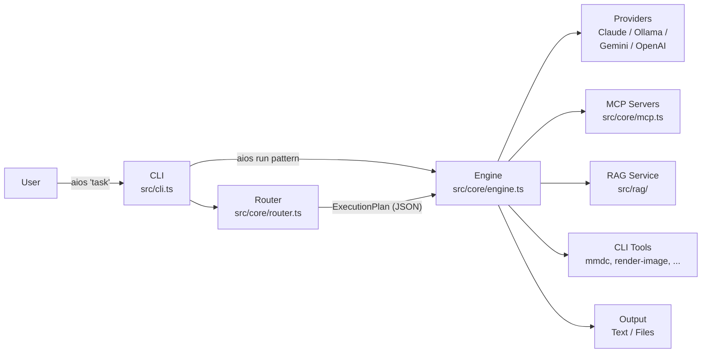
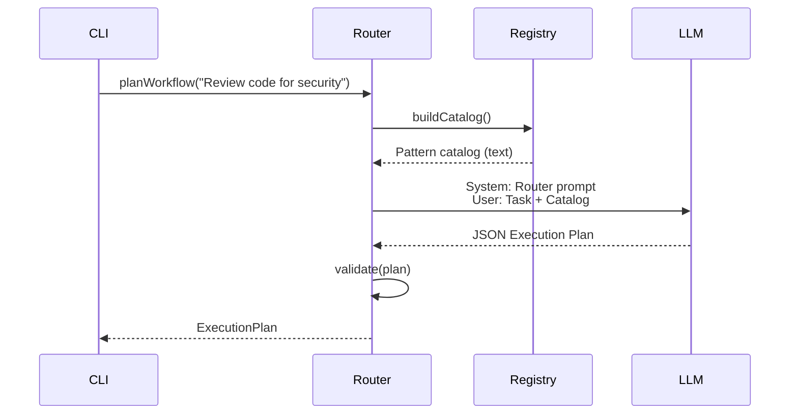
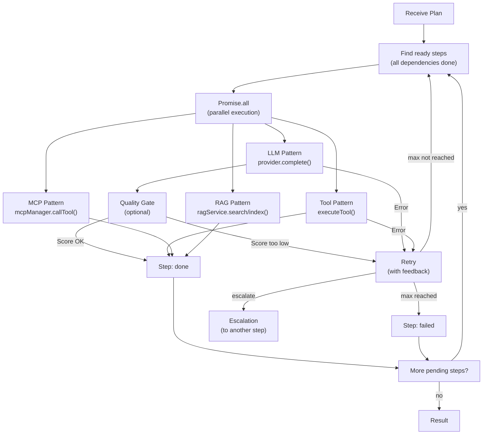
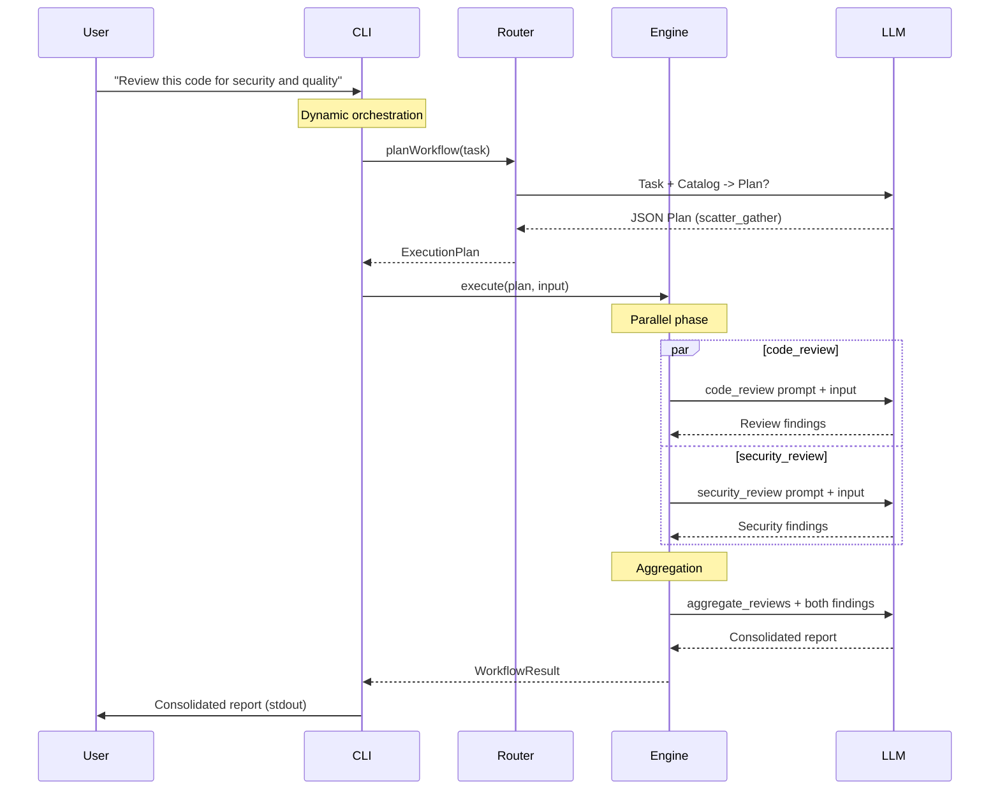

> **Audience:** Developers

# AIOS Architecture

AIOS is a CLI-based AI orchestration system. It decomposes natural-language tasks into workflows of reusable patterns and executes them in parallel where possible. This document describes the system architecture, components, data flow, and project structure.

---

## 1. System Overview

AIOS is organized into three layers:

| Layer | Responsibility | Component |
|-------|---------------|-----------|
| **Planning** | Analyze the task, select patterns, build a workflow | Router (`src/core/router.ts`) |
| **Execution** | Run the plan mechanically -- parallelism, retry, rollback | Engine (`src/core/engine.ts`) |
| **Patterns** | Reusable prompts, tool definitions, MCP tools, RAG operations | Registry (`src/core/registry.ts`) + `patterns/` |



The Router is itself an LLM call. It receives the task plus a compact pattern catalog and returns a JSON execution plan. The Engine then executes the plan step by step, respecting dependencies and running independent steps in parallel.

---

## 2. Components

### 2.1 CLI (`src/cli.ts`)

Entry point. Parses commands via Commander.js and wires up the core components (Registry, Router, Engine, providers, MCP, RAG).

**Commands:**

| Command | Description |
|---------|-------------|
| `aios "task"` | Router plans a workflow, Engine executes it |
| `aios run <pattern>` | Run a single pattern directly (stdin -> LLM/Tool -> stdout) |
| `aios plan "task"` | Generate execution plan only (JSON output, no execution) |
| `aios chat [--provider <name>]` | Interactive REPL with slash commands |
| `aios patterns list [--category <cat>]` | List all patterns, grouped by category |
| `aios patterns search <query>` | Full-text search across name, description, tags |
| `aios patterns show <name>` | Show pattern details (frontmatter + prompt) |
| `aios patterns create <name>` | Scaffold a new pattern from template |

**Conventions:** Logging goes to `stderr`, results go to `stdout` (Unix pipe-compatible).

### 2.2 Pattern Registry (`src/core/registry.ts`)

Loads all `patterns/*/system.md` files at startup. Each file contains YAML frontmatter (metadata for the Router) and a Markdown prompt (for LLM execution). MCP tools discovered at runtime are registered as virtual patterns via `registerVirtual()`.


**Frontmatter Schema:**

```yaml
name: string                    # Unique pattern name
version: "1.0"                  # Versioning
description: string             # Short description
category: string                # analyze | generate | review | transform | report | tool | meta
input_type: string              # text | code | design | requirements | ...
output_type: string             # text | code | findings | file | ...
tags: [string]                  # For search and filtering
type: llm | tool | mcp | rag   # Default: llm
tool: string                    # Only for type: tool. CLI command (e.g. "mmdc")
tool_args: [string]             # Args template: ["$INPUT", "-o", "$OUTPUT"]
input_format: string            # Only for type: tool. Input file extension
output_format: [string]         # Only for type: tool. Possible output formats
parameters:                     # Optional parameters (--key=value in CLI)
  - name: string
    type: string | enum | number | boolean
    values: [string]            # Only for type: enum
    default: any
    description: string
can_follow: [string]            # Which patterns can precede this one
can_precede: [string]           # Which patterns can follow this one
parallelizable_with: [string]   # Can run in parallel with these patterns
persona: string                 # Assigned persona (e.g. "architect")
preferred_provider: string      # Preferred LLM provider
internal: boolean               # true = hidden from catalog
```

**Registry API:**

| Method | Returns | Purpose |
|--------|---------|---------|
| `get(name)` | `Pattern \| undefined` | Fetch a single pattern by name |
| `all()` | `Pattern[]` | All loaded patterns |
| `list()` | `string[]` | All pattern names |
| `search(query)` | `Pattern[]` | Full-text search (name, description, tags) |
| `byCategory(cat)` | `Pattern[]` | Filter by category |
| `categories()` | `string[]` | All distinct categories |
| `toolPatterns()` | `Pattern[]` | Only patterns with `type: tool` |
| `isToolAvailable(tool)` | `boolean` | Check if CLI tool is installed (cached via `which`) |
| `buildCatalog()` | `string` | Compact text representation for the Router |
| `registerVirtual(pattern)` | `void` | Register an in-memory pattern (used by MCP) |

`buildCatalog()` produces a condensed text listing that includes only frontmatter metadata -- never the full prompt. This is what the Router sees when planning.

### 2.3 Router (`src/core/router.ts`)

The Router is itself an LLM call. It receives the user's task plus the pattern catalog and returns a JSON execution plan.



**Execution Plan Structure:**

```json
{
  "analysis": {
    "goal": "Security and quality review",
    "complexity": "medium",
    "requires_compliance": false,
    "disciplines": ["security", "code-quality"]
  },
  "plan": {
    "type": "scatter_gather",
    "steps": [
      {
        "id": "review1",
        "pattern": "code_review",
        "depends_on": [],
        "input_from": ["$USER_INPUT"],
        "parallel_group": "reviews"
      },
      {
        "id": "review2",
        "pattern": "security_review",
        "depends_on": [],
        "input_from": ["$USER_INPUT"],
        "parallel_group": "reviews"
      },
      {
        "id": "aggregate",
        "pattern": "aggregate_reviews",
        "depends_on": ["review1", "review2"],
        "input_from": ["review1", "review2"]
      }
    ]
  },
  "reasoning": "Parallel reviews with aggregation"
}
```

**Four Plan Types:**

| Type | When | Example |
|------|------|---------|
| `pipe` | Simple task, 1-2 steps | `summarize` |
| `scatter_gather` | Parallel perspectives + merge | Code review + Security review -> Aggregate |
| `dag` | Dependent steps with partial parallelism | Requirements -> Design -> parallel Code + Tests |
| `saga` | Regulated, with quality gates and retry | Feature development with compliance |

**Validation:** The Router checks that all referenced patterns exist in the registry and that there are no circular dependencies among `depends_on` edges.

### 2.4 Engine (`src/core/engine.ts`)

Executes an `ExecutionPlan` mechanically. Topological sort determines step order, `Promise.all` runs independent steps in parallel, retry and escalation handle failures.

The Engine supports four step types:

- **LLM** -- Sends the pattern's Markdown prompt as `system` and the assembled input as `user` to the provider. Optionally checks a quality gate.
- **Tool** -- Invokes a CLI tool (e.g. `mmdc` for Mermaid rendering). Input is written to a temp file, the tool is executed, output is read from the result file.
- **MCP** -- Calls a tool on an MCP server via the `McpManager`. The MCP server is spawned on demand and tools are discovered dynamically.
- **RAG** -- Delegates to the `RAGService` for search, index, or compare operations against vector stores.

**Vision support:** When a step receives image output from upstream steps (e.g., a rendered diagram), the Engine calls `collectImages()` to gather base64-encoded images from prior `StepResult` entries. The `ProviderSelector` picks the cheapest available provider with the `vision` capability.



**LLM Pattern Execution:**

1. Assemble input from `$USER_INPUT` and/or outputs of previous steps
2. Combine persona system prompt (if assigned) with pattern system prompt
3. Collect images from upstream steps via `collectImages()` (if any)
4. Call `provider.complete(systemPrompt, input, images)` (or vision provider via `ProviderSelector`)
5. Optionally evaluate a quality gate (score X/10)
6. Store `StepResult` with `outputType: "text"`

**Tool Pattern Execution:**

1. Security: verify the tool is in `config.tools.allowed`
2. Availability: check if the tool is installed (`which`)
3. Write input to a temp file
4. Invoke CLI tool with `tool_args` template (`$INPUT` -> temp path, `$OUTPUT` -> output path)
5. Clean up temp files
6. Store `StepResult` with `outputType: "file"` and `filePath`

**MCP Pattern Execution:**

1. Parse input as JSON arguments matching the tool's input schema
2. Call `mcpManager.callTool(server, tool, args)`
3. Extract image file paths from output if present
4. Store `StepResult`

**RAG Pattern Execution:**

1. Dispatch to `ragService.search()`, `.index()`, or `.compare()` based on the pattern's `rag_operation` field
2. Store search results or indexing confirmation as `StepResult`

**Retry / Escalation:**

- `retry.max`: Maximum retry count. The error message is fed back as context for the next attempt.
- `retry.on_failure: "escalate"`: On final failure, activates another step (e.g., escalate from Developer back to Architect).
- `compensate`: Saga rollback -- runs a compensation pattern if the step fails permanently.

### 2.5 Provider Abstraction (`src/agents/provider.ts`)

Unified interface for all LLM backends:

```typescript
interface LLMProvider {
  complete(system: string, user: string, images?: string[]): Promise<LLMResponse>;
  chat(system: string, messages: Array<{ role: "user" | "assistant"; content: string }>, images?: string[]): Promise<LLMResponse>;
}
```

The optional `images` parameter accepts base64-encoded image data. When present, the provider includes image content blocks alongside the text message.

**Four Providers:**

| Provider | Class | Transport | Auth |
|----------|-------|-----------|------|
| Claude | `ClaudeProvider` | Anthropic SDK (`@anthropic-ai/sdk`) | `ANTHROPIC_API_KEY` env var |
| Ollama | `OllamaProvider` | REST (`/api/chat`) | Optional Bearer token for remote servers |
| Gemini | `GeminiProvider` | REST (Google AI) | API key in config |
| OpenAI | `OpenAIProvider` | REST (OpenAI-compatible) | Bearer token |

Factory: `createProvider(config: ProviderConfig): LLMProvider` reads `config.type` and instantiates the matching class.

**Provider Selector** (`src/agents/provider-selector.ts`): Cost-based, capability-aware selection. Given a required capability (e.g., `"vision"`), it filters providers that declare the capability in their config, skips those without API keys (except Ollama), and sorts by `cost_per_mtok` ascending. The cheapest available provider wins.

```typescript
selector.select("vision")  // -> { name: "gemini-flash", provider: GeminiProvider }
```

### 2.6 MCP Manager (`src/core/mcp.ts`)

Manages Model Context Protocol server connections. Spawns server processes lazily via `StdioClientTransport`, caches `Client` instances per server.

Key operations:

- **Connect:** `connect(serverName)` -- start MCP server process from config
- **Discover:** `listTools(serverName)` -- enumerate available tools via MCP protocol
- **Register:** `registerMcpTools()` -- write virtual patterns into the Registry, making them available to the Router for planning
- **Execute:** `callTool(server, tool, args)` -- invoke a tool at execution time
- **Shutdown:** `shutdown()` -- close all transports and server processes

Discovered tools become patterns named `{prefix}/{toolName}` with `type: "mcp"`. Servers can be added and removed at runtime via `addServer()` and `removeServer()`.

### 2.7 RAG Service (`src/rag/`)

Retrieval-Augmented Generation support with three operations exposed as patterns:

- **search** -- Embed a query, perform cosine-similarity search against a vector store, return top-k results with optional query expansion
- **index** -- Preprocess documents (field concatenation, cleaners, chunking), embed them, and upsert into a vector store
- **compare** -- Cross-collection pairwise similarity between source and target documents

| File | Purpose |
|------|---------|
| `rag-service.ts` | Service facade: search, index, compare |
| `vector-store.ts` | In-memory vector store with cosine similarity |
| `embedding-provider.ts` | Embedding provider interface |
| `ollama-embedder.ts` | Ollama-based embeddings (REST endpoint) |
| `local-embedder.ts` | Local embedding fallback (in-process) |
| `preprocessing.ts` | Document chunking and text normalization |
| `types.ts` | RAG-specific type definitions |

### 2.8 Configuration (`src/utils/config.ts`)

Three sources, in descending priority:

1. `./aios.yaml` (project-local)
2. `~/.aios/config.yaml` (global / user-level)
3. Defaults (hardcoded)

Each level is shallow-merged over the defaults.

```typescript
interface AiosConfig {
  providers: Record<string, ProviderConfig>;  // LLM backends with cost_per_mtok, capabilities
  defaults: { provider: string };             // Default provider name
  paths: { patterns: string; personas: string };
  tools: {
    output_dir: string;    // Where tool outputs are written
    allowed: string[];     // Allowlist of permitted CLI tools
  };
  mcp?: Record<string, McpServerConfig>;      // MCP server configurations
  rag?: Record<string, RAGCollectionConfig>;   // RAG collection settings
}
```

---

## 3. Data Flow: Concrete Example

**Input:** `aios "Review this code for security and quality"`



**Simple tasks produce simple plans.** The Router recognizes complexity and scales accordingly:

```bash
aios "Summarize this meeting protocol"
```

```json
{
  "plan": {
    "type": "pipe",
    "steps": [
      { "id": "summarize", "pattern": "summarize",
        "depends_on": [], "input_from": ["$USER_INPUT"] }
    ]
  },
  "reasoning": "Simple summarization, one pattern suffices."
}
```

One step. No overhead. Medium complexity (e.g., thorough code review) becomes a `scatter_gather` with parallel reviews and aggregation.

---

## 4. Key Insight: What the Router Sees vs. What the Engine Executes

### The Two Faces of a system.md

Every pattern file has TWO roles -- the Router and the Engine each read a different part:

```
security_review/system.md
=====================================================

+---------------------------------------------------+
|  YAML FRONTMATTER (for the Router)                |
|                                                    |
|  name: security_review                             |
|  description: "Security-focused code review"       |
|  input_type: code                                  |
|  output_type: security_findings                    |
|  parallelizable_with: [code_review, arch_review]   |
|                                                    |
|  -> The ROUTER reads ONLY this part               |
|  -> It understands: "This tool checks code for    |
|     security and can run in parallel with          |
|     code_review"                                   |
+---------------------------------------------------+

+---------------------------------------------------+
|  MARKDOWN PROMPT (for execution)                   |
|                                                    |
|  # IDENTITY and PURPOSE                            |
|  You are a cybersecurity expert...                 |
|                                                    |
|  -> The ENGINE reads ONLY this part               |
|  -> It is sent as the system prompt to the LLM    |
|  -> The Router never sees this part               |
+---------------------------------------------------+
```

### Information Flow: Registry -> Router -> Engine

```
Registry                    Router                      Engine
-------------------------   -------------------------   -------------------------
Reads all system.md         Receives compact catalog    Receives ExecutionPlan
Extracts frontmatter        (~50 lines for 20           Opens system.md again
-> builds catalog text      patterns) + task            IGNORES frontmatter
                            -> produces JSON plan        USES Markdown prompt
                                                         as system prompt
```

### The Toolbox Analogy

Patterns describe THEMSELVES so the Router can use them as building blocks -- without knowing their internal prompts. Think of a **toolbox**: the LABEL on each tool (frontmatter) tells the planner what it can do. The INSTRUCTIONS (prompt) are only read by the executor. The Router says: "Use the Phillips screwdriver." The Engine says: "OK, here is how to use it."

---

## 5. Project Structure

```
AIOS/
├── src/
│   ├── cli.ts                          # Entry point, CLI commands
│   ├── types.ts                        # All TypeScript interfaces
│   ├── core/
│   │   ├── engine.ts                   # DAG/Saga execution engine
│   │   ├── engine.test.ts              # Engine tests
│   │   ├── registry.ts                 # Pattern Registry (loads system.md + MCP virtual patterns)
│   │   ├── registry.test.ts            # Registry tests
│   │   ├── router.ts                   # Meta-Agent (plans workflows via LLM)
│   │   ├── router.test.ts              # Router tests
│   │   ├── mcp.ts                      # MCP server manager + tool discovery
│   │   ├── mcp.test.ts                 # MCP tests
│   │   ├── personas.ts                 # Persona registry (loads personas/*.yaml)
│   │   ├── knowledge.ts                # Knowledge base utilities
│   │   ├── knowledge.test.ts           # Knowledge tests
│   │   ├── repl.ts                     # Interactive REPL (aios chat)
│   │   ├── repl.test.ts                # REPL tests
│   │   ├── slash.ts                    # Slash command handler
│   │   └── slash.test.ts               # Slash command tests
│   ├── agents/
│   │   ├── provider.ts                 # LLMProvider interface + Claude, Ollama
│   │   ├── provider.test.ts            # Provider tests
│   │   ├── gemini-provider.ts          # Google Gemini provider (REST)
│   │   ├── gemini-provider.test.ts     # Gemini tests
│   │   ├── openai-provider.ts          # OpenAI-compatible provider (REST)
│   │   ├── openai-provider.test.ts     # OpenAI tests
│   │   ├── provider-selector.ts        # Cost-based capability-aware selection
│   │   └── provider-selector.test.ts   # Selector tests
│   ├── rag/
│   │   ├── rag-service.ts              # RAG service facade (search, index, compare)
│   │   ├── rag-service.test.ts         # RAG service tests
│   │   ├── vector-store.ts             # In-memory vector store with cosine similarity
│   │   ├── vector-store.test.ts        # Vector store tests
│   │   ├── embedding-provider.ts       # Embedding provider interface
│   │   ├── ollama-embedder.ts          # Ollama-based embeddings
│   │   ├── local-embedder.ts           # Local embedding fallback
│   │   ├── preprocessing.ts            # Document chunking and normalization
│   │   ├── preprocessing.test.ts       # Preprocessing tests
│   │   └── types.ts                    # RAG-specific type definitions
│   └── utils/
│       ├── config.ts                   # YAML config loading (3-source merge)
│       ├── config.test.ts              # Config tests
│       ├── stdin.ts                    # stdin helper
│       └── stdin.test.ts               # stdin tests
├── patterns/
│   ├── _router/system.md               # Router meta-prompt (internal)
│   ├── aggregate_reviews/system.md
│   ├── architecture_review/system.md
│   ├── code_review/system.md
│   ├── compliance_report/system.md
│   ├── design_solution/system.md
│   ├── evaluate_quality/system.md
│   ├── extract_knowledge/system.md
│   ├── extract_requirements/system.md
│   ├── formalize/system.md
│   ├── gap_analysis/system.md
│   ├── generate_adr/system.md
│   ├── generate_code/system.md
│   ├── generate_diagram/system.md
│   ├── generate_docs/system.md
│   ├── generate_image_prompt/system.md
│   ├── generate_tests/system.md
│   ├── identify_risks/system.md
│   ├── pdf_vision_ocr/system.md
│   ├── rag_index/system.md
│   ├── rag_search/system.md
│   ├── refactor/system.md
│   ├── render_diagram/system.md
│   ├── render_image/system.md
│   ├── requirements_review/system.md
│   ├── risk_report/system.md
│   ├── security_review/system.md
│   ├── simplify_text/system.md
│   ├── summarize/system.md
│   ├── test_report/system.md
│   ├── test_review/system.md
│   ├── threat_model/system.md
│   ├── translate_technical/system.md
│   ├── write_architecture_doc/system.md
│   └── write_user_doc/system.md
├── personas/
│   ├── architect.yaml
│   ├── developer.yaml
│   ├── quality_manager.yaml
│   ├── re.yaml
│   ├── reviewer.yaml
│   ├── security_expert.yaml
│   ├── tech_writer.yaml
│   └── tester.yaml
├── tools/
│   └── render-image.sh                # Wrapper script for image rendering
├── docs/
│   ├── ARCHITECTURE.md                 # System architecture (this file)
│   ├── MCP.md                          # MCP integration guide
│   ├── PERSONAS.md                     # Persona system
│   ├── PHASES.md                       # Development phases
│   ├── REGULATED.md                    # Regulated environments
│   ├── compliance.md                   # Compliance documentation
│   ├── configuration.md               # Configuration guide
│   ├── getting-started.md             # Getting started guide
│   ├── patterns.md                     # Pattern documentation
│   ├── providers.md                    # Provider documentation
│   ├── rag.md                          # RAG documentation
│   ├── roadmap.md                      # Project roadmap
│   ├── user-guide.md                   # User guide
│   ├── vision.md                       # Vision/OCR documentation
│   ├── workflows.md                    # Workflow patterns (lowercase, MkDocs)
│   ├── WORKFLOWS.md                    # Workflow patterns (uppercase)
│   └── reference/
│       ├── 01-basic-pattern-engine.ts  # Reference: basic pattern engine
│       ├── 02-parallel-workflows.ts    # Reference: parallel workflows
│       └── 03-dynamic-orchestration.ts # Reference: dynamic orchestration
├── aios.yaml                           # Project-local config
├── azdo-config.json                    # Azure DevOps configuration
├── mkdocs.yml                          # MkDocs site configuration
├── package.json                        # Node.js project manifest
├── tsconfig.json                       # TypeScript configuration
├── CLAUDE.md                           # Claude Code instructions
└── README.md                           # Project readme
```
