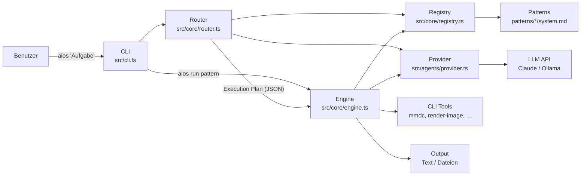
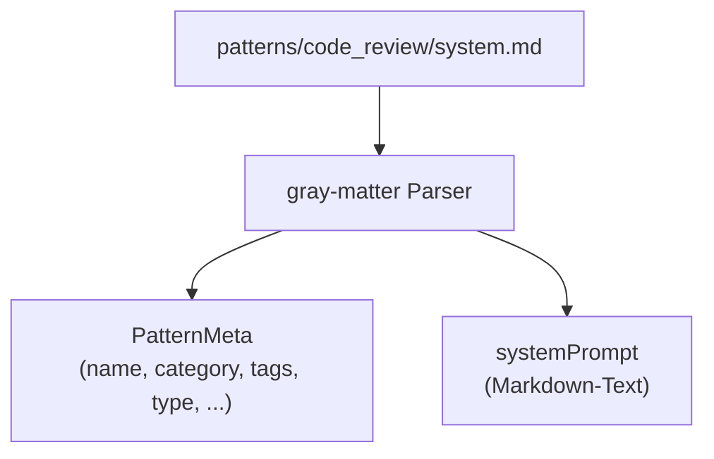
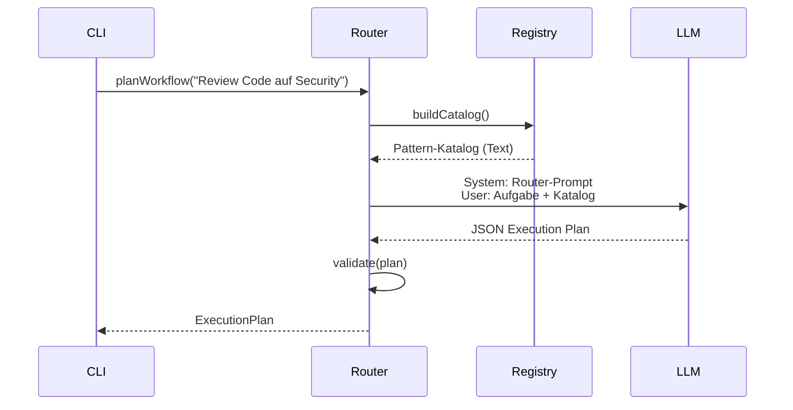
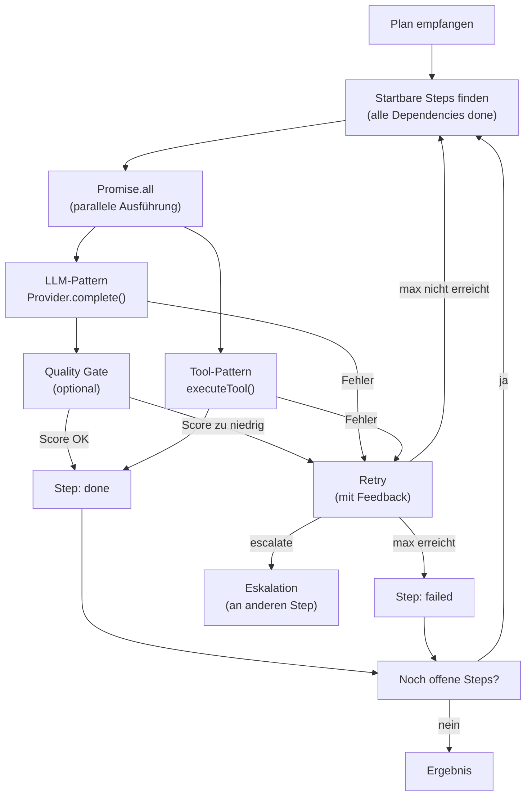
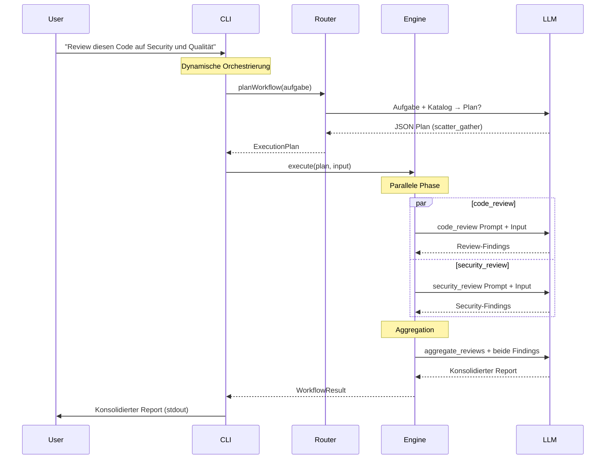

# AIOS Architektur

## 1. Systemübersicht

AIOS ist ein CLI-basiertes AI-Orchestrierungssystem. Es zerlegt natürlichsprachliche Aufgaben in Workflows aus wiederverwendbaren Patterns und führt diese parallel aus.



### Drei Schichten

| Schicht | Aufgabe | Komponente |
|---------|---------|------------|
| **Planung** | Aufgabe analysieren, Workflow planen | Router (`src/core/router.ts`) |
| **Ausführung** | Plan mechanisch abarbeiten, Parallelität, Retry | Engine (`src/core/engine.ts`) |
| **Patterns** | Wiederverwendbare Prompts + Tool-Definitionen | Registry (`src/core/registry.ts`) + `patterns/` |

---

## 2. Komponenten

### 2.1 CLI (`src/cli.ts`)

Entry Point. Parst Befehle via Commander.js und verbindet die Kernkomponenten.

**Befehle:**

| Befehl | Funktion |
|--------|----------|
| `aios "Aufgabe"` | Router plant → Engine führt aus |
| `aios run <pattern>` | Ein Pattern direkt (stdin → LLM/Tool → stdout) |
| `aios plan "Aufgabe"` | Nur Plan erzeugen (JSON) |
| `aios patterns list` | Patterns auflisten |
| `aios patterns search <q>` | Patterns durchsuchen |
| `aios patterns show <name>` | Pattern-Details |
| `aios patterns create <name>` | Neues Pattern (Template) |

**Konventionen:** Logging auf `stderr`, Ergebnisse auf `stdout` (Unix-Pipe-kompatibel).

### 2.2 Pattern Registry (`src/core/registry.ts`)

Lädt alle `patterns/*/system.md` Dateien beim Start. Jede Datei enthält YAML-Frontmatter (Metadaten) und einen Markdown-Prompt (für LLM-Ausführung).



**Frontmatter-Schema (vollständig):**

```yaml
name: string                    # Eindeutiger Name
version: "1.0"                  # Versionierung
description: string             # Kurzbeschreibung
category: string                # analyze | generate | review | transform | report | tool | meta
input_type: string              # text | code | design | requirements | ...
output_type: string             # text | code | findings | file | ...
tags: [string]                  # Für Suche und Filterung
type: llm | tool                # Default: llm. "tool" = CLI-Tool statt LLM
tool: string                    # Nur bei type: tool. CLI-Befehl (z.B. "mmdc")
tool_args: [string]             # Args-Template: ["$INPUT", "-o", "$OUTPUT"]
input_format: string            # Nur bei type: tool. Dateiendung Input
output_format: [string]         # Nur bei type: tool. Mögliche Output-Formate
parameters:                     # Optionale Parameter (--key=value in CLI)
  - name: string
    type: string | enum | number | boolean
    values: [string]            # Nur bei type: enum
    default: any
    description: string
can_follow: [string]            # Welche Patterns davor kommen können
can_precede: [string]           # Welche Patterns danach kommen können
parallelizable_with: [string]   # Parallel ausführbar mit
persona: string                 # Zugewiesene Persona (z.B. "architect")
preferred_provider: string      # Bevorzugter LLM-Provider
internal: boolean               # true = nicht im Katalog sichtbar
```

**API der Registry:**

| Methode | Rückgabe | Zweck |
|---------|----------|-------|
| `get(name)` | `Pattern \| undefined` | Ein Pattern laden |
| `all()` | `Pattern[]` | Alle Patterns |
| `list()` | `string[]` | Alle Namen |
| `search(query)` | `Pattern[]` | Volltextsuche (Name, Beschreibung, Tags) |
| `byCategory(cat)` | `Pattern[]` | Nach Kategorie filtern |
| `categories()` | `string[]` | Alle Kategorien |
| `toolPatterns()` | `Pattern[]` | Nur Tool-Patterns |
| `isToolAvailable(tool)` | `boolean` | Prüft ob CLI-Tool installiert ist (cached) |
| `buildCatalog()` | `string` | Kompakter Text für den Router |

### 2.3 Router (`src/core/router.ts`)

Der Router ist selbst ein LLM-Call. Er bekommt die Aufgabe + den Pattern-Katalog und erzeugt einen JSON Execution Plan.



**Execution Plan Struktur:**

```json
{
  "analysis": {
    "goal": "Security und Qualitäts-Review",
    "complexity": "medium",
    "requires_compliance": false,
    "disciplines": ["security", "code-quality"]
  },
  "plan": {
    "type": "scatter_gather",
    "steps": [
      {
        "id": "review1",
        "pattern": "code_review",
        "depends_on": [],
        "input_from": ["$USER_INPUT"],
        "parallel_group": "reviews"
      },
      {
        "id": "review2",
        "pattern": "security_review",
        "depends_on": [],
        "input_from": ["$USER_INPUT"],
        "parallel_group": "reviews"
      },
      {
        "id": "aggregate",
        "pattern": "aggregate_reviews",
        "depends_on": ["review1", "review2"],
        "input_from": ["review1", "review2"]
      }
    ]
  },
  "reasoning": "Parallele Reviews mit Aggregation"
}
```

**Workflow-Typen:**

| Typ | Wann | Beispiel |
|-----|------|----------|
| `pipe` | Einfache Aufgabe, 1 Step | `summarize` |
| `scatter_gather` | Parallele Perspektiven + Zusammenführung | Code Review + Security Review → Aggregate |
| `dag` | Abhängige Schritte mit Parallelität | Requirements → Design → parallel Code + Tests |
| `saga` | Reguliert, mit Quality Gates und Retry | Feature-Entwicklung mit Compliance |

**Validierung:** Der Router prüft, dass alle referenzierten Patterns existieren und keine zirkulären Dependencies vorliegen.

### 2.4 Engine (`src/core/engine.ts`)

Führt einen Execution Plan mechanisch aus. Topologische Sortierung, `Promise.all` für parallele Steps, Retry/Escalation bei Fehlern.



**LLM-Pattern Ausführung:**

1. Input zusammenbauen aus `$USER_INPUT` und/oder Outputs vorheriger Steps
2. `provider.complete(systemPrompt, input)` aufrufen
3. Optional: Quality Gate prüfen (Score X/10)
4. `StepResult` mit `outputType: "text"` speichern

**Tool-Pattern Ausführung:**

1. Security: Prüfen ob Tool in `config.tools.allowed` steht
2. Verfügbarkeit: Prüfen ob Tool installiert ist (`which`)
3. Input in Temp-Datei schreiben
4. CLI-Tool mit `tool_args`-Template aufrufen (`$INPUT` → Temp-Pfad, `$OUTPUT` → Output-Pfad)
5. Temp-Datei aufräumen
6. `StepResult` mit `outputType: "file"` und `filePath` speichern

**Retry/Escalation:**

- `retry.max`: Maximale Wiederholungen. Fehlermeldung wird als Feedback zum nächsten Versuch hinzugefügt.
- `retry.on_failure: "escalate"`: Bei endgültigem Fehler wird ein anderer Step aktiviert.

### 2.5 Provider Abstraction (`src/agents/provider.ts`)

Einheitliches Interface für LLM-Backends.

```typescript
interface LLMProvider {
  complete(system: string, user: string): Promise<LLMResponse>;
}
```

| Provider | Klasse | API |
|----------|--------|-----|
| Claude | `ClaudeProvider` | Anthropic SDK (`@anthropic-ai/sdk`) |
| Ollama | `OllamaProvider` | REST (`/api/chat`, lokal) |

Factory: `createProvider(config)` erzeugt den richtigen Provider basierend auf `config.type`.

### 2.6 Konfiguration (`src/utils/config.ts`)

Drei Quellen, absteigend priorisiert:

1. `./aios.yaml` (Projekt-lokal)
2. `~/.aios/config.yaml` (Global)
3. Defaults (hardcoded)

```typescript
interface AiosConfig {
  providers: Record<string, ProviderConfig>;  // LLM-Backends
  defaults: { provider: string };             // Standard-Provider
  paths: { patterns: string; personas: string };
  tools: {
    output_dir: string;    // Wohin Tool-Outputs geschrieben werden
    allowed: string[];     // Allowlist erlaubter CLI-Tools
  };
}
```

---

## 3. Datenfluss: Konkretes Beispiel

**Eingabe:** `aios "Review diesen Code auf Security und Qualität"`



---

## 4. Pattern-Typen

### LLM-Pattern (Standard)

```
Input (Text) → [LLM mit system.md Prompt] → Output (Text)
```

28 LLM-Patterns in 6 Kategorien: analyze, generate, review, transform, report, meta.

### Tool-Pattern

```
Input (Text) → [CLI-Tool] → Output (Datei: PNG, SVG, ...)
```

Kein LLM-Aufruf. Das Tool wird über `tool_args` konfiguriert:

```yaml
type: tool
tool: mmdc
tool_args: ["-i", "$INPUT", "-o", "$OUTPUT", "-t", "dark"]
```

Die Engine ersetzt `$INPUT` und `$OUTPUT` durch temporäre Dateipfade.

**Sicherheit:** Nur Tools in `config.tools.allowed` dürfen ausgeführt werden.

---

## 5. Personas

Personas definieren Rollen für Agenten. Sie sind in `personas/*.yaml` gespeichert und werden über das `persona`-Feld im Pattern-Frontmatter referenziert.

| Persona | Rolle | Patterns |
|---------|-------|----------|
| `re` | Requirements Engineer | extract_requirements, requirements_review, gap_analysis |
| `architect` | Software Architect | design_solution, architecture_review, identify_risks, generate_adr |
| `developer` | Developer | generate_code, refactor |
| `tester` | QA Engineer | generate_tests, test_report, test_review |
| `security_expert` | Security Expert | security_review, threat_model |
| `reviewer` | Code Reviewer | code_review |
| `tech_writer` | Technical Writer | write_architecture_doc, write_user_doc, generate_docs |
| `quality_manager` | Quality Manager | compliance_report, risk_report |

---

## 6. Erweiterungspunkte

### Neues LLM-Pattern

```bash
npx tsx src/cli.ts patterns create my_pattern --category=analyze
```

Oder manuell: `patterns/my_pattern/system.md` mit Frontmatter + Prompt erstellen.

### Neues Tool-Pattern

1. CLI-Tool installieren oder Wrapper-Script in `tools/` erstellen
2. `patterns/my_tool/system.md` mit `type: tool` und `tool_args` erstellen
3. Tool zur Allowlist in `aios.yaml` hinzufügen

### Neuer LLM-Provider

1. Klasse implementieren die `LLMProvider` Interface erfüllt (`complete(system, user)`)
2. In `createProvider()` Factory registrieren
3. In `aios.yaml` konfigurieren

### Neue Persona

YAML-Datei in `personas/` erstellen mit `id`, `role`, `expertise`, `preferred_patterns`.

---

## 7. Tech Stack

| Komponente | Technologie | Zweck |
|------------|-------------|-------|
| Runtime | Node.js 20+ | Plattform |
| Sprache | TypeScript (ESM, strict) | Typsicherheit |
| CLI | Commander.js + chalk | Befehlsparser + Farben |
| LLM | Anthropic SDK + Ollama REST | Provider |
| Pattern-Parser | gray-matter | YAML-Frontmatter aus Markdown |
| Config | yaml | YAML-Parsing |
| DB (geplant) | better-sqlite3 | Knowledge Base |
| Tests | vitest | Unit Tests |

---

## 8. Verzeichnisstruktur

```
src/
├── cli.ts                 # Entry Point, CLI-Befehle
├── types.ts               # Alle TypeScript Interfaces
├── core/
│   ├── registry.ts        # Pattern Registry (lädt system.md)
│   ├── router.ts          # Meta-Agent (plant Workflows)
│   └── engine.ts          # DAG/Saga Execution Engine
├── agents/
│   └── provider.ts        # LLM Provider Abstraction
└── utils/
    ├── config.ts           # YAML Config Management
    └── stdin.ts            # stdin Helper

patterns/*/system.md       # Pattern Library (30 Patterns)
personas/*.yaml            # Persona-Definitionen
tools/                     # Wrapper-Scripts für Tool-Patterns
docs/                      # Dokumentation
```
