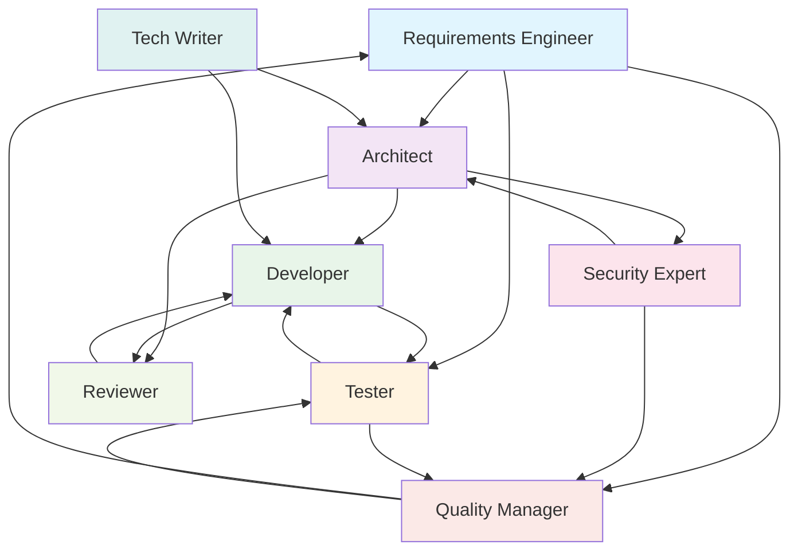

> **Audience:** Developers

# Personas: The Virtual Team

## What Are Personas?

Personas are predefined roles with a `system_prompt`, domain expertise, and preferred patterns. They represent specialized team members in the virtual development team. Each persona is defined as a YAML file in `personas/` and can be assigned to patterns in two ways:

1. **Pattern frontmatter** -- The `persona` field in a pattern's YAML frontmatter binds that pattern to a specific role (e.g., `persona: security_expert` in `security_review/system.md`).
2. **Router assignment** -- The Router can dynamically assign personas when planning a workflow, based on task requirements and pattern metadata.

Persona definitions are loaded by the `PersonaRegistry` (`src/core/personas.ts`).

---

## The Team

| ID | Role | Preferred Patterns |
|----|------|--------------------|
| `re` | Requirements Engineer | `extract_requirements`, `gap_analysis`, `requirements_review` |
| `architect` | Software Architect | `design_solution`, `architecture_review`, `generate_adr`, `identify_risks`, `threat_model` |
| `developer` | Developer | `generate_code`, `generate_tests`, `refactor` |
| `tester` | QA Engineer | `generate_tests`, `test_review`, `test_report` |
| `security_expert` | Security Expert | `security_review`, `threat_model`, `compliance_report` |
| `reviewer` | Code Reviewer | `code_review`, `architecture_review` |
| `tech_writer` | Technical Writer | `write_architecture_doc`, `write_user_doc`, `generate_docs`, `summarize` |
| `quality_manager` | Quality Manager | `compliance_report`, `risk_report` |

---

## Team Interaction



---

## Runtime Combination

When the Engine executes a step that has both a persona and a pattern, the system prompts are concatenated:

```
system_prompt = persona.system_prompt + "\n\n---\n\n" + pattern.systemPrompt
```

This means the persona provides the agent's identity and communication style, while the pattern provides the task-specific instructions. For example, a `security_expert` persona running the `threat_model` pattern gets:

1. **Persona prompt:** "You are a cybersecurity expert with deep knowledge of OWASP, STRIDE, IEC 62443..."
2. **Separator:** `---`
3. **Pattern prompt:** "# IDENTITY and PURPOSE\nAnalyze the given system design and produce a STRIDE threat model..."

The persona ID is resolved in order of precedence:

1. `step.persona` -- explicitly set by the Router in the execution plan
2. `pattern.meta.persona` -- default persona declared in the pattern's frontmatter
3. No persona -- pattern's system prompt is used alone

---

## Creating a New Persona

Create a YAML file in `personas/`:

```yaml
# personas/devops.yaml
name: DevOps Engineer
id: devops
role: CI/CD & Infrastructure

description: >
  Manages build pipelines, deployment processes, and infrastructure.

system_prompt: |
  You are an experienced DevOps engineer with expertise in
  CI/CD, container orchestration, and Infrastructure as Code.

expertise:
  - CI/CD Pipelines
  - Container Orchestration
  - Infrastructure as Code

preferred_patterns:
  - generate_pipeline
  - deployment_review

preferred_provider: claude

communicates_with:
  - developer
  - architect

output_format: markdown
```

The persona is automatically discovered on the next startup and immediately available for use by the Router and Engine.
