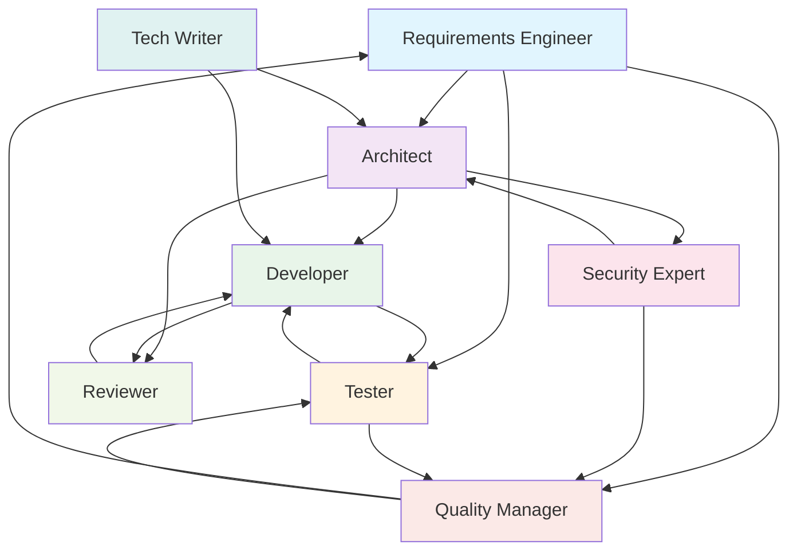

# Personas: Das virtuelle Entwicklungsteam

## Was sind Personas?

Personas sind vordefinierte Rollen mit spezifischem System-Prompt, Expertise und bevorzugten Patterns. Der Router kann Personas automatisch zuweisen, wenn eine Aufgabe zu einer Rolle passt. Jede Persona kennt ihre Kommunikationspartner im Team und abonniert relevante Events.

Die Persona-Definitionen befinden sich in `personas/*.yaml`.

## Das Team im Ueberblick

| ID | Rolle | Bevorzugte Patterns |
|----|-------|---------------------|
| `re` | Requirements Engineering & Analyse | `extract_requirements`, `gap_analysis`, `requirements_review` |
| `architect` | Architektur & Technisches Design | `design_solution`, `architecture_review`, `generate_adr`, `identify_risks`, `threat_model` |
| `developer` | Implementierung & Code-Generierung | `generate_code`, `generate_tests`, `refactor` |
| `tester` | Testing & Qualitaetssicherung | `generate_tests`, `test_review`, `test_report` |
| `security_expert` | Cybersecurity & Compliance | `security_review`, `threat_model`, `compliance_report` |
| `reviewer` | Code Review & Qualitaetsanalyse | `code_review`, `architecture_review` |
| `tech_writer` | Technical Writer & Documentation Engineer | `write_architecture_doc`, `write_user_doc`, `generate_docs`, `summarize` |
| `quality_manager` | Qualitaetsmanagement & Compliance Reporting | `compliance_report`, `risk_report` |

## Team-Interaktion



## Neue Persona erstellen

Eine neue YAML-Datei in `personas/` anlegen:

```yaml
# personas/devops.yaml
name: DevOps Engineer
id: devops
role: CI/CD & Infrastructure

description: >
  Verwaltet Build-Pipelines, Deployment-Prozesse und Infrastruktur.

system_prompt: |
  Du bist ein erfahrener DevOps Engineer mit Expertise in
  CI/CD, Container-Orchestrierung und Infrastructure as Code.

expertise:
  - CI/CD Pipelines
  - Container-Orchestrierung
  - Infrastructure as Code

preferred_patterns:
  - generate_pipeline
  - deployment_review

preferred_provider: claude

communicates_with:
  - developer
  - architect

output_format: markdown
```

Die Persona wird beim naechsten Start automatisch erkannt und ist sofort nutzbar.
